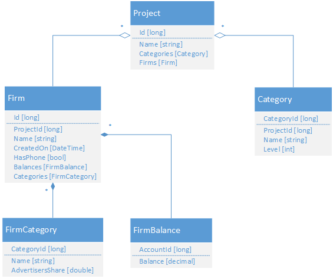

# Details on Querying component

We started to explore **Querying** component in [high-level overview article](README.md) with the following bounded context:



Just to remind, it's conceptual model's description looks like this::

```csharp
StructuralModelElementBuilder ConceptualModel =
StructuralModelElement.Config
    .Elements(
        EntityElement.Config.Name(EntityName.Project).EntitySetName("Projects")
            .HasKey("Id")
            .Property(EntityPropertyElement.Config.Name("Id").OfType(ElementaryTypeKind.Int64))
            .Property(EntityPropertyElement.Config.Name("Name").OfType(ElementaryTypeKind.String))
            .Relation(EntityRelationElement.Config.Name("Categories").DirectTo(EntityElement.Config.Name(EntityName.Category)).AsMany().AsContainment())
            .Relation(EntityRelationElement.Config.Name("Firms").DirectTo(EntityElement.Config.Name(EntityName.Firm)).AsMany().AsContainment()),

        EntityElement.Config
            .Name(EntityName.Category).EntitySetName("Categories")
            .HasKey("CategoryId")
            .Property(EntityPropertyElement.Config.Name("CategoryId").OfType(ElementaryTypeKind.Int64))
            .Property(EntityPropertyElement.Config.Name("ProjectId").OfType(ElementaryTypeKind.Int64))
            .Property(EntityPropertyElement.Config.Name("Name").OfType(ElementaryTypeKind.String))
            .Property(EntityPropertyElement.Config.Name("Level").OfType(ElementaryTypeKind.Int32)),

         EntityElement.Config
            .Name(EntityName.Firm).EntitySetName("Firms")
            .HasKey("Id")
            .Property(EntityPropertyElement.Config.Name("Id").OfType(ElementaryTypeKind.Int64))
            .Property(EntityPropertyElement.Config.Name("ProjectId").OfType(ElementaryTypeKind.Int64))
            .Property(EntityPropertyElement.Config.Name("Name").OfType(ElementaryTypeKind.String))
            .Property(EntityPropertyElement.Config.Name("CreatedOn").OfType(ElementaryTypeKind.DateTimeOffset))
            .Property(EntityPropertyElement.Config.Name("HasPhone").OfType(ElementaryTypeKind.Boolean))
            .Relation(EntityRelationElement.Config.Name("Balances")
                .DirectTo(
                    EntityElement.Config
                        .Name(EntityName.FirmBalance)
                        .HasKey("AccountId")
                        .Property(EntityPropertyElement.Config.Name("AccountId").OfType(ElementaryTypeKind.Int64))
                        .Property(EntityPropertyElement.Config.Name("ProjectId").OfType(ElementaryTypeKind.Int64))
                        .Property(EntityPropertyElement.Config.Name("Balance").OfType(ElementaryTypeKind.Decimal))
                ).AsMany())
            .Relation(EntityRelationElement.Config.Name("Categories")
                .DirectTo(
                    EntityElement.Config
                        .Name(EntityName.FirmCategory)
                        .HasKey("CategoryId")
                        .Property(EntityPropertyElement.Config.Name("CategoryId").OfType(ElementaryTypeKind.Int64))
                        .Property(EntityPropertyElement.Config.Name("Name").OfType(ElementaryTypeKind.String))
                        .Property(EntityPropertyElement.Config.Name("AdvertisersShare").OfType(ElementaryTypeKind.Double))
                ).AsMany().AsContainment()));
```

Next, we need to describe it's schema in a data storage. The current version of **NuClear River** works with relational DBs only, but other storage types can be also supported in the future. Community contributions are welcomed on this point as well.

So, the data model (store model) for relational DB for that bounded context can be described by the following:

```csharp
StructuralModelElementBuilder StoreModel =
StructuralModelElement.Config.Elements(
    EntityElement.Config
        .Name(TableName.Project)
        .HasKey("Id")
        .Property(EntityPropertyElement.Config.Name("Id").OfType(ElementaryTypeKind.Int64))
        .Property(EntityPropertyElement.Config.Name("Name").OfType(ElementaryTypeKind.String)),
    EntityElement.Config
        .Name(TableName.ProjectCategory)
        .HasKey("ProjectId", "CategoryId")
        .Property(EntityPropertyElement.Config.Name("CategoryId").OfType(ElementaryTypeKind.Int64))
        .Property(EntityPropertyElement.Config.Name("Name").OfType(ElementaryTypeKind.String))
        .Property(EntityPropertyElement.Config.Name("Level").OfType(ElementaryTypeKind.Int32))
        .Property(EntityPropertyElement.Config.Name("SalesModel").OfType(ElementaryTypeKind.Int32))
        .Relation(EntityRelationElement.Config.Name("ProjectId").DirectTo(EntityElement.Config.Name(TableName.Project)).AsOne()),
    EntityElement.Config
        .Name(TableName.Firm)
        .HasKey("Id")
        .Property(EntityPropertyElement.Config.Name("Id").OfType(ElementaryTypeKind.Int64))
        .Property(EntityPropertyElement.Config.Name("Name").OfType(ElementaryTypeKind.String))
        .Property(EntityPropertyElement.Config.Name("CreatedOn").OfType(ElementaryTypeKind.DateTimeOffset))
        .Property(EntityPropertyElement.Config.Name("HasPhone").OfType(ElementaryTypeKind.Boolean))
        .Relation(EntityRelationElement.Config.Name("ProjectId").DirectTo(EntityElement.Config.Name(TableName.Project)).AsOne()),
    EntityElement.Config
        .Name(TableName.FirmBalance)
        .HasKey("FirmId", "AccountId")
        .Property(EntityPropertyElement.Config.Name("AccountId").OfType(ElementaryTypeKind.Int64))
        .Property(EntityPropertyElement.Config.Name("ProjectId").OfType(ElementaryTypeKind.Int64))
        .Property(EntityPropertyElement.Config.Name("Balance").OfType(ElementaryTypeKind.Decimal))
        .Relation(EntityRelationElement.Config.Name("FirmId").DirectTo(EntityElement.Config.Name(TableName.Firm)).AsOne()),
    EntityElement.Config
        .Name(TableName.FirmCategory)
        .HasKey("FirmId", "CategoryId")
        .Property(EntityPropertyElement.Config.Name("FirmId").OfType(ElementaryTypeKind.Int64))
        .Property(EntityPropertyElement.Config.Name("CategoryId").OfType(ElementaryTypeKind.Int64))
        .Property(EntityPropertyElement.Config.Name("Name").OfType(ElementaryTypeKind.String))
        .Property(EntityPropertyElement.Config.Name("AdvertisersShare").OfType(ElementaryTypeKind.Double))
        .Relation(EntityRelationElement.Config.Name("FirmId").DirectTo(EntityElement.Config.Name(TableName.Firm)).AsOne());
```

The last thing we need to do here is to map conceptual model to store model. The resulted bounded context description will look like this:

```csharp
BoundedContextElement Context =
    BoundedContextElement.Config.Name("CustomerIntelligence")
        .ConceptualModel(ConceptualModel)
        .StoreModel(StoreModel)
        .Map(EntityName.Project, TableName.Project)
        .Map(EntityName.Category, TableName.ProjectCategory)
        .Map(EntityName.Firm, ViewName.Firm)
        .Map(EntityName.FirmBalance, TableName.FirmBalance)
        .Map(EntityName.FirmCategory, TableName.FirmCategory);
```

As you can see here, all descriptions are very straightforward. In conceptual level we have relations among objects, at store level - relations among DB tables. 

Now, let's see under the hood of **Querying** component to understand how it works.

As it was mentioned in [high-level overview article](README.md), **Querying** built on top of ASP.NET Web API. So, it exposes it's API through controllers.

The first thing to highlight here is `DynamicControllersRegistrar` class in `NuClear.Querying.Web.OData.DynamicControllers` namespace. It's responsible for controller types creation (emitting) in runtime using metadata descriptions:

```csharp
public sealed class DynamicControllersRegistrar
{
    public DynamicControllersRegistrar(
        IMetadataProvider metadataProvider, 
        IDynamicAssembliesRegistry registry)
    {
        _metadataProvider = metadataProvider;
        _registry = registry;
    }

    public void RegisterDynamicControllers(Uri uri)
    {
        BoundedContextElement boundedContextElement;
        if (!_metadataProvider.TryGetMetadata(uri, out boundedContextElement))
        {
            throw new ArgumentException();
        }

        var dynamicAssembly = CreateDynamicControllersAssembly(boundedContextElement);
        _registry.RegisterDynamicAssembly(dynamicAssembly);
    }

    // Implementation details ommited for readability
}

```

As you can see here, `DynamicControllersRegistrar` creates separate assemblies with controller types for different bounded contexts.

The actual code with implementation details is [here](https://github.com/2gis/nuclear-river/blob/master/Querying/Querying.Web.OData/DynamicControllers/DynamicControllersRegistrar.cs).

Then `ODataModelRegistratrar` type comes into play. It registers all provided bounded contexts with `System.Web.Http.HttpServer` instance and creates a pipeline of HTTP request handling:

```csharp
public sealed class ODataModelRegistratrar
{
    public ODataModelRegistratrar(
        IMetadataProvider metadataProvider, 
        DynamicControllersRegistrar dynamicControllersRegistrar, 
        EdmModelWithClrTypesBuilder edmModelWithClrTypesBuilder)
    {
            _metadataProvider = metadataProvider;
            _dynamicControllersRegistrar = dynamicControllersRegistrar;
            _edmModelWithClrTypesBuilder = edmModelWithClrTypesBuilder;
    }

    public void RegisterModels(HttpServer httpServer)
    {
        MetadataSet metadataSet;
        if (!_metadataProvider.TryGetMetadata<QueryingMetadataIdentity>(out metadataSet))
        {
            return;
        }

        var contexts = metadataSet.Metadata.Values.OfType<BoundedContextElement>();
        foreach (var context in contexts)
        {
            var contextId = context.Identity.Id;
            var edmModel = _edmModelWithClrTypesBuilder.Build(contextId);

            var routePrefix = contextId.Segments.Last();
            MapRoute(routePrefix, edmModel, httpServer, ConfigureHttpRequest);

            _dynamicControllersRegistrar.RegisterDynamicControllers(contextId);
        }
    }    

    // Implementation details ommited for readability
}
```

The actual code with implementation details is [here](https://github.com/2gis/nuclear-river/blob/master/Querying/Querying.Web.OData/ODataModelRegistratrar.cs).

The last important thing to notice here is `EdmModelWithClrTypesBuilder` and it's dependencies. `EdmModelWithClrTypesBuilder` type is just a facade that executes the following tasks:

* builds [EDM](https://msdn.microsoft.com/library/ee382825.aspx) model with `EdmModelBuilder` class instance
* builds Entity Framework model ([DbModel](https://msdn.microsoft.com/en-us/library/system.data.entity.infrastructure.dbmodel.aspx)) with `EdmxModelBuilder` class instance
* annotates EDM model's types with CLR types from DbModel

As the result, we obtain consistent instance of type `IEdmModel` that will be used to configure OData middleware from `Microsoft.AspNet.OData` package. 

It's also need to be notices, that we use the same bounded context's metadata descriptions through all stages, so changes in these descriptions leads to controllers, CLR types and models updating respectivetely without having to write additional code. 