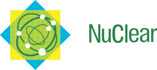
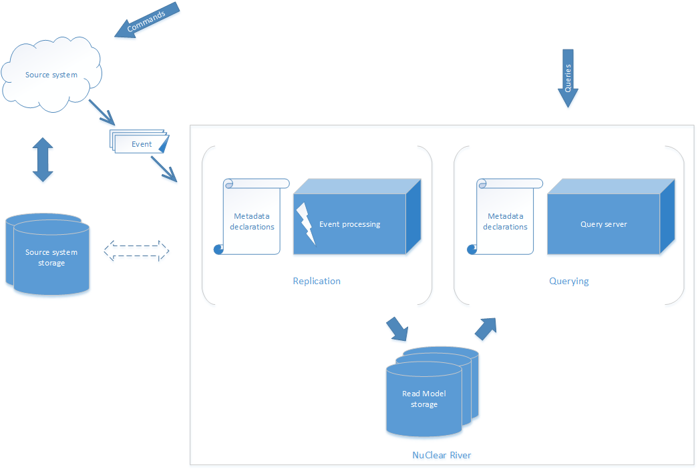

# Документация NuClear River

> **Warning** Работа над документацией еще не закончена.

**NuClear River** - это настраиваемая платформа для построения [Read Model-ей](http://codebetter.com/gregyoung/2010/02/15/cqrs-is-more-work-because-of-the-read-model/) в терминах [CQRS (Command Query Responsibility Segregation)](https://cqrs.files.wordpress.com/2010/11/cqrs_documents.pdf).

Вы когда-нибудь сталкивались с подобными проблемами?

* Данные приложения хорошо структурированы для выполнения create/update/delete, но запросы на чтение получаются (очень) сложными
* Выделяются различные наборы запросов на чтение данных над одной структурой, каждый из таких наборов - для решения бизнес-задач в разных, часто непересекающихся областях. Или даже больше, есть несколько приложений, которые читают одни и те же данные
* Запросы на чтение выполняются медленно
* Структура данных меняется очень часто, поэтому приходтся поддеживать обновления и в кейсах записи, в кейсах чтения, даже если требования к кейсам чтения не меняются
* Всегда приходится искать баланс между запросами на чтение и запросами на запись при попытках оптимизировать работу с хранилищем данных (например, при создании индексов в SQL хранилищах)

Если ответ "да", то точно стоит посмотреть в сторону применения паттерна CQRS. **NuClear River** - это платформа, сильно упрощающая жизнь в том, что кроется за буквой "Q" в аббривеатуре CQRS (**C**ommands and **Q**uery **R**esponsibility **S**egregation).

Ниже на картинке показано, как **NuClear River** может быть в строена в вашу инфраструктуру:

На самом деле, всё, что нужно, чтобы построить Read Model - это события, генерируемые системой-источником в ответ на выполнение команд. Забегая вперед, стоит сказать, что структура событий (данные, содержащиеся в событии) может быть любой, но по-крайней мере должна содержать идентификаторы объектов, которые были изменены. Предпочтительно, если сразу будет доступна информация о деталях изменений, но это не обязательно.

Важно также, что Read Model может быть построена только для конкретного ограниченного контекста (bounded context) вашей доменной области. Структура конечной Read Model-и обычно продиктована кейсами чтения (денормализована) и может значительно отличаться от структуры данных в системе-источнике, где основные потребности - это выполнение reate/update/delete операций. Кроме того, полученная Read Model может содержать данные из нескольких систем.

Результат, который достигается за счет использования **NuClear River** - стеки чтения и записи отделены друг от друга и могут развиваться независимо. Таким образом, это быстрый способ применить подход CQRS для проектирования конкретной (ограниченной) части вашего приложения (приложений) для реализации конкретных кейсов бизнес-логики.

Высокоуровневый дизайн **NuClear River** описан [в этой статье](design-overview/README.md) (на английском).